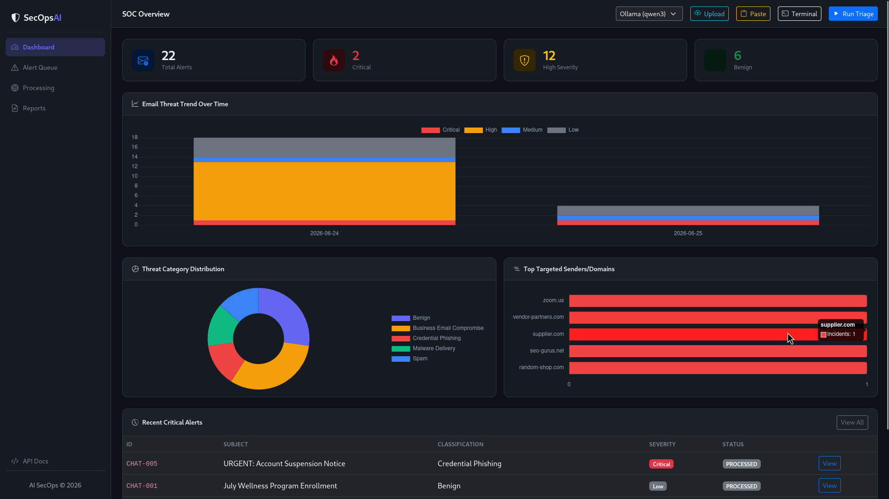
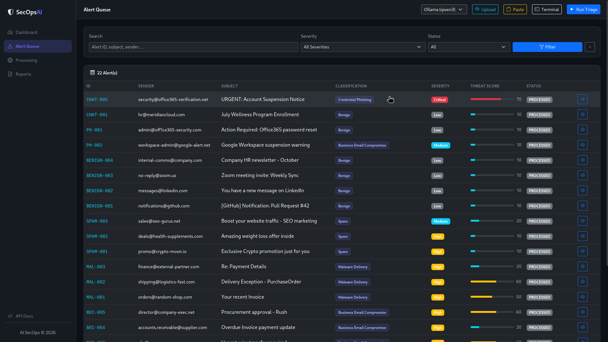
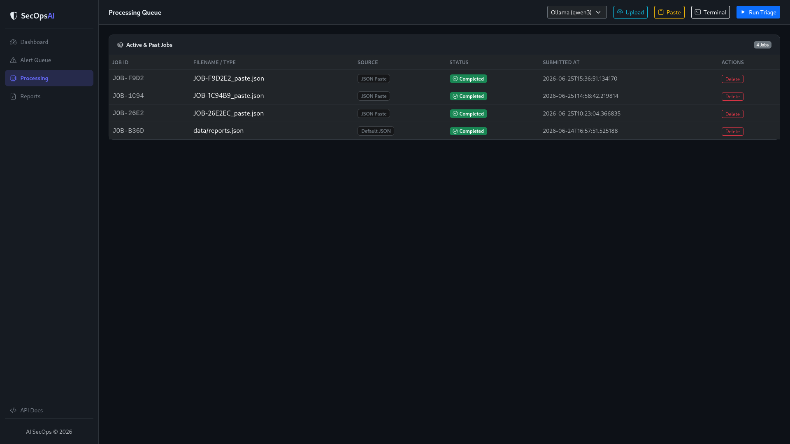
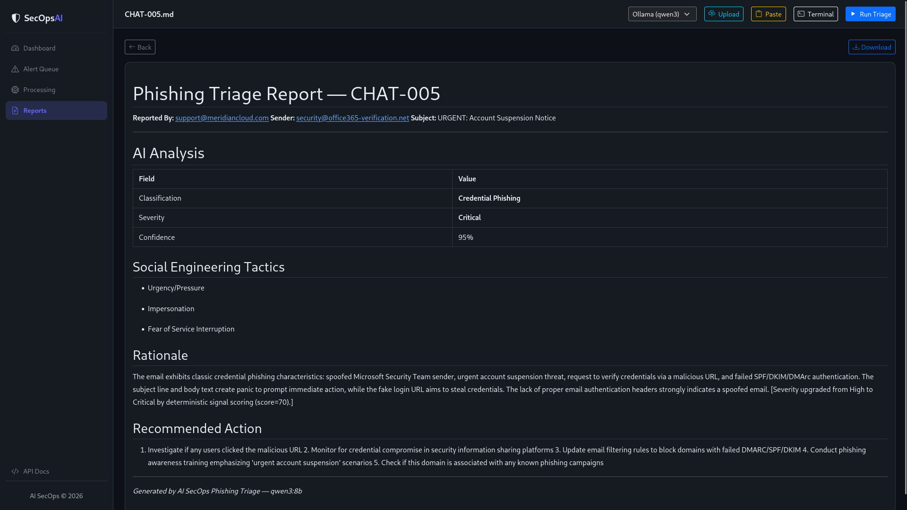
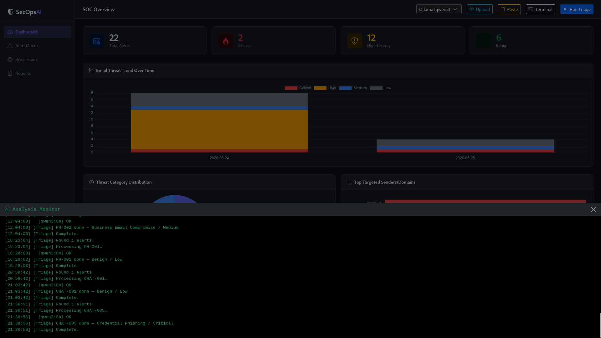
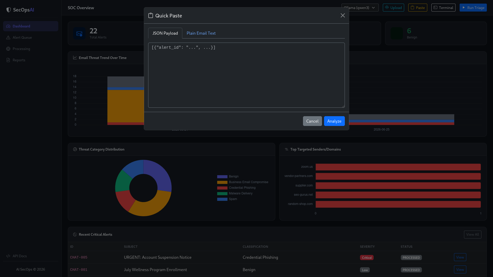

# AI SecOps Phishing Triage

## Overview

AI SecOps Phishing Triage is an end-to-end phishing email triage platform designed to automate the initial stages of Security Operations Center (SOC) investigations.

The system ingests employee-reported email alerts, performs deterministic security analysis, enriches findings using Large Language Models (LLMs), generates analyst-ready incident reports, and maintains persistent alert state to support reliable and repeatable processing.

The goal is to reduce analyst triage time while keeping human reviewers in the decision-making loop for final remediation actions.

---

## Screenshots

<p align="center">
  
  
  
</p>

<p align="center">
  
  
  
</p>

---

## Key Features

### AI-Powered Threat Analysis

- Email classification using LLMs
- Severity assessment
- Social engineering tactic identification
- Analyst rationale generation
- Recommended remediation actions

### Deterministic Security Analysis

- SPF validation
- DKIM validation
- DMARC validation
- URL extraction
- Attachment risk detection
- Threat scoring
- Keyword-based phishing detection

### Operational Workflow

- Persistent SQLite state management
- Alert lifecycle tracking
- Duplicate processing prevention
- Audit logging
- Markdown incident report generation

### Web Interface

- Dashboard overview
- Alert management
- Report browsing
- File upload support
- Processing monitoring

---

## Technology Stack

| Component      | Technology                  |
| -------------- | --------------------------- |
| Backend        | FastAPI                     |
| Frontend       | HTML, CSS, Jinja2 Templates |
| Database       | SQLite                      |
| Validation     | Pydantic                    |
| LLM (Primary)  | qwen3:8b (Ollama)           |
| LLM (Fallback) | llama3.1:8b (Ollama)        |
| Optional LLM   | Gemini                      |
| Retry Logic    | Tenacity                    |
| Reporting      | Markdown                    |
| Templating     | Jinja2                      |

---

## Architecture

### High-Level Data Flow

```text
Incoming Alert (JSON)
         │
         ▼
 ┌─────────────────┐
 │ Ingestion Layer │
 └────────┬────────┘
          │
          ▼
 ┌─────────────────┐
 │ Parser &        │
 │ Validation      │
 └────────┬────────┘
          │
          ▼
 ┌─────────────────┐
 │ Feature         │
 │ Extraction      │
 └────────┬────────┘
          │
          ▼
 ┌─────────────────┐
 │ Threat Scoring  │
 │ + LLM Analysis  │
 └────────┬────────┘
          │
 ┌────────┴────────┐
 ▼                 ▼
SQLite        Markdown
State DB       Reports
 │
 ▼
Dashboard
```

---

## Project Structure

```text
ai-secops-phishing-triage/

├── app/
│   ├── main.py
│   │
│   ├── core/
│   │   ├── config.py
│   │   ├── constants.py
│   │   ├── database.py
│   │   └── logger.py
│   │
│   ├── models/
│   │   ├── alert.py
│   │   ├── enrichment.py
│   │   └── state.py
│   │
│   ├── services/
│   │   ├── parser.py
│   │   ├── features.py
│   │   ├── llm.py
│   │   ├── reputation.py
│   │   ├── pipeline.py
│   │   ├── reporter.py
│   │   └── state_manager.py
│   │
│   ├── routes/
│   │   ├── dashboard.py
│   │   ├── alerts.py
│   │   ├── reports.py
│   │   ├── processing.py
│   │   └── api.py
│   │
│   ├── templates/
│   └── static/
│
├── data/
│   ├── reports.json
│   └── uploads/
│
├── reports/
│
├── state/
│   └── alerts.db
│
├── tests/
│   ├── test_parser.py
│   ├── test_llm.py
│   └── test_state.py
│
├── README.md
├── SCALING.md
├── requirements.txt
├── run.sh
└── run_web.sh
```

---

## Core Components

### Parser (`services/parser.py`)

Responsible for:

- Loading phishing reports
- Validating schema compliance
- Normalizing alert records
- Handling malformed input safely

Validation is performed using Pydantic models to ensure downstream stages receive structured data.

---

### Feature Extraction (`services/features.py`)

Extracts deterministic security indicators including:

- SPF failures
- DKIM failures
- DMARC failures
- URL presence
- Suspicious attachment types
- Credential harvesting language
- Urgency indicators
- Financial fraud indicators

These features are used for threat scoring and AI enrichment.

---

### AI Enrichment (`services/llm.py`)

The platform uses a hybrid approach combining rule-based detection with LLM reasoning.

Supported providers:

- qwen3:8b (default)
- llama3.1:8b (fallback)
- Gemini (optional)

The model receives:

- Email metadata
- Message content
- Authentication results
- Extracted security indicators

The model returns:

- Classification
- Severity
- Confidence score
- Social engineering tactics
- Analyst rationale
- Recommended action

---

## AI Prompt Design

The prompt is designed to produce reliable structured output.

The model is instructed to classify alerts into:

- Credential Phishing
- Business Email Compromise
- Malware Delivery
- Spam
- Benign
- Unknown

The model must also:

- Assign severity
- Explain reasoning
- Identify social engineering techniques
- Recommend analyst actions

Expected response schema:

```json
{
  "classification": "",
  "severity": "",
  "confidence": 0,
  "social_engineering_tactics": [],
  "rationale": "",
  "recommended_action": ""
}
```

Malformed responses trigger retry and fallback logic.

---

## Threat Scoring

Before AI analysis, the system calculates a deterministic threat score.

| Indicator              | Score |
| ---------------------- | ----- |
| SPF Fail               | +10   |
| DKIM Fail              | +10   |
| DMARC Fail             | +10   |
| Credential Request     | +30   |
| Urgent Payment Request | +30   |
| Executable Attachment  | +40   |

The final severity is derived from the higher value between deterministic scoring and AI assessment.

This prevents AI output from downgrading obviously dangerous alerts.

---

## Resilience & Fault Tolerance

### Retry Logic

Transient failures are automatically retried using Tenacity with exponential backoff.

### Model Fallback

Provider order:

```text
Primary:
qwen3:8b

Fallback:
llama3.1:8b

Optional:
Gemini
```

### Safe Failure Mode

If all providers fail:

```text
Classification:
Unknown

Severity:
Medium

Recommended Action:
Manual Review
```

No alert is silently discarded.

---

## State Management

SQLite is used to maintain alert processing state.

Tracked information includes:

- Alert ID
- Processing status
- Classification
- Severity
- Threat score
- Timestamps

Alert lifecycle:

```text
NEW
TRIAGED
ESCALATED
CLOSED
```

This enables idempotent processing and prevents duplicate analysis.

---

## Incident Report Generation

For every processed alert, the system generates an analyst-ready Markdown report.

Example:

```markdown
# Incident Report: PH-005

## Classification

Credential Phishing

## Severity

Critical

## Confidence

96%

## Social Engineering Tactics

- Urgency
- Authority Impersonation

## Rationale

Sender impersonates Microsoft and attempts credential harvesting through urgency-based messaging.

## Recommended Action

Block sender domain and notify affected employees.
```

Generated reports are stored in:

```text
reports/
```

---

## Installation

### Requirements

- Python 3.10+
- Ollama

Optional:

- Gemini API Key

### Setup

```bash
git clone <repository_url>

cd ai-secops-phishing-triage

python -m venv venv

source venv/bin/activate

pip install -r requirements.txt
```

Download models:

```bash
ollama pull qwen3:8b
ollama pull llama3.1:8b
```

---

## Environment Variables

Create a `.env` file:

```env
DATABASE_PATH=state/alerts.db
REPORTS_DIR=reports
DATA_FILE=data/reports.json
HOST=0.0.0.0
PORT=8000
GEMINI_API_KEY=
```

---

## Running the Application

Start the web application:

```bash
./run_web.sh
```

or

```bash
uvicorn app.main:app --reload --port 8000
```

Open:

```text
http://localhost:8000
```

---

## Dashboard Features

### Dashboard

- Alert statistics
- Severity distribution
- Classification overview

### Alert Management

- View alerts
- Alert details
- Status updates

### Processing

- Run triage pipeline
- Upload alert files
- Monitor processing status

### Reports

- Browse reports
- View generated reports
- Download reports

---

## Additional Features Beyond Assessment Requirements

- Interactive web dashboard
- Multiple LLM provider support
- Automatic model fallback
- Threat scoring engine
- File upload workflow
- Processing status tracking
- Audit logging
- Report management interface
- Automated report generation
- Unit tests

---

## Testing

Run tests:

```bash
pytest
```

Coverage includes:

- Parser validation
- LLM integration
- State management

---

## Future Improvements

- VirusTotal enrichment
- AbuseIPDB integration
- URLHaus integration
- Slack notifications
- Discord notifications
- Microsoft Graph email ingestion
- Campaign clustering
- Similarity-based deduplication
- Analyst feedback loop

---

## Assumptions

- All phishing reports are synthetic.
- The project is a proof-of-concept implementation.
- SQLite is sufficient for assessment-scale workloads.
- Human analysts remain responsible for final remediation decisions.

---

## Scaling

Production scaling considerations are documented in:

```text
SCALING.md
```

Topics covered:

- Queue-based processing
- Throughput optimization
- LLM cost management
- Deduplication
- Observability
- Fault tolerance
- Partial failure handling

---

## License

Created as part of the AI SecOps Automation Challenge assessment.
